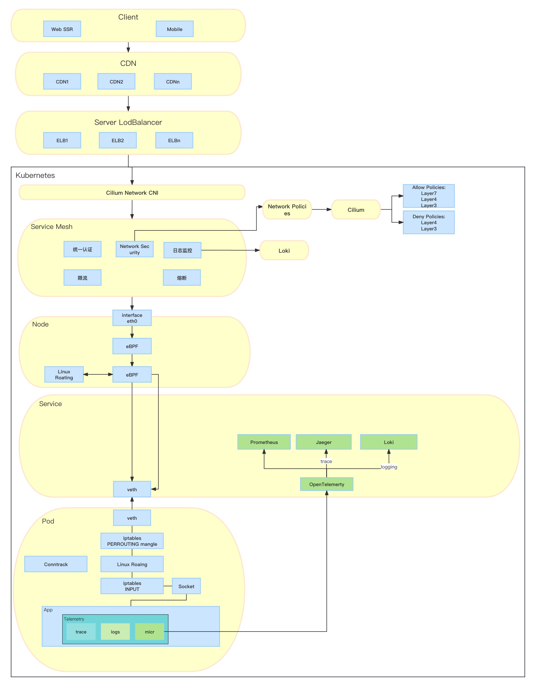

# Kubernetes Cloud Native Deploy

## Observability and Analysis

### Observability

1. Prometheus: 采集与查询应用/数据库指标
2. Grafana Loki: 采集日志
3. fluentd(观望中): 采集日志
4. Jaeger: HTTP/RPC链路跟踪
5. OpenTelemetry: 可观测性集合
6. ELK/EFK: 分析/量化/查询
7. Kiali: 应用链路图

## App Definition and Development

### Application Definition & Image Build

1. Helm
2. OLM(Operator Lifecycle Manager)
3. Docker Compose

### Continuous Integration & Delivery

1. Argo
2. flux
3. Gitlab CI Runner
4. GitHub Actions

### Database

1. MongoDB
2. Redis
3. Postgres

### Streaming & Messaging

1. Kafka
    1. strimzi: 先进的生产环境部署Kafka的方式
    2. bitnami: 流行的部署方式
    3. confluent: kafka背后的公司confluent的部署方式
2. Strimzi: 在 Kubernetes 上运行的 Apache Kafka
3. Apache RocketMQ: 一个云原生消息传递和流式处理平台，可以轻松构建事件驱动的应用程序。
4. Apache Heron （Incubating:） 是 Twitter 的实时、分布式、容错流处理引擎

## Orchestration & Management

### Scheduling & Orchestration

1. Kubernetes
2. Docker

### API Gateway

1. Higress

### Service Proxy

1. OpenELB
2. PureLB
3. Nginx

### Remote Procedure Call

1. gRPC
2. Kratos

### Service Mesh

1. Istio
2. Consul

### Coordination & Service Discovery

1. CoreDNS
2. etcd
3. Zookeeper(in kafka dir)

## Runtime

### Cloud Native Storage

1. CSI/NFS
2. Minio

### Cloud Native Network

1. flannel
2. cilium
3. CNI

### Container Runtime

1. Containerd

## Security & Compliance

1. cert-manager

### Container Registry

1. Harbor

### Automation & Configuration

1. Terraform
2. Ansible

## 软件工程

